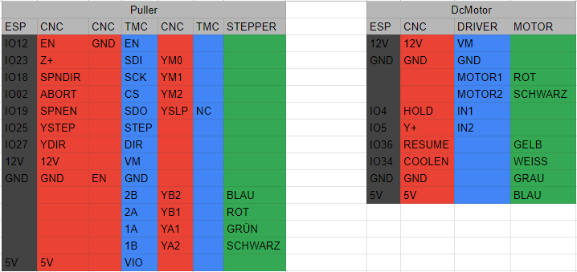

# Interactive Pinout visualization Tool

### Problem:
I am often unsure which pins I can use when starting a new electronics project. It becomes especially hard if you stack multiple boards, as you lose track on which pin of the microcontroller gets forwarded to which pin on the stacked modules.

### Solution:
A Tool to visualize the pinout of a board with the ability to use mapping files to inherit the pin functions and names of an MC stacked in the first layer.

### Current State:
- change board image, pinout and mapping file in the code manually
- label and name pins and print resulting json to console
- highlight all pins with same name on hover
- use a mapping file to rename the pins on the shield according to underlying source pins

### Nice to have features:
It would be cool to have a tool where you just select the components you have e.g. Microcontroller, Display, Rotary Encoder, Stepper Motor, Motor Driver... and the tool automatically gives you wiring instructions or an error if not enough pins are available on your MC.
- auto generation of pin connection tables in this style: 
- selection of multiple electronic components in UI e.g. in a sidebar
- Popovers with pin functions on hover
- automatic wiring detection based on which functions the input pin needs and which functions an output pin provides (elimination of json mapping files)
- pin filtering for e.g. only pwm output pins
- creation of own board labeling in UI (image upload, label, pin function selection, storing)
- use nice svg graphics instead of board photos
- add more boards
- automatically read pin information from e.g. KiCad or Fritzing
- pressing ctrl to allow pin placement only on same axis as previous pin

### How to run?
- `npm run start`
